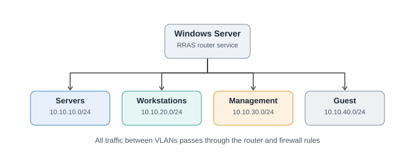
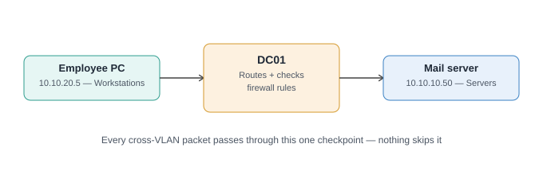
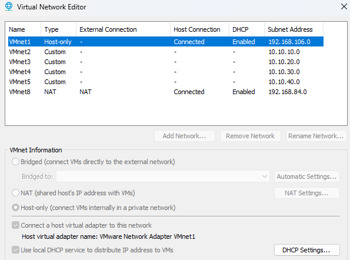
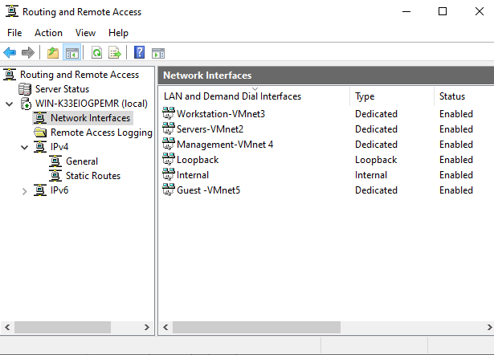
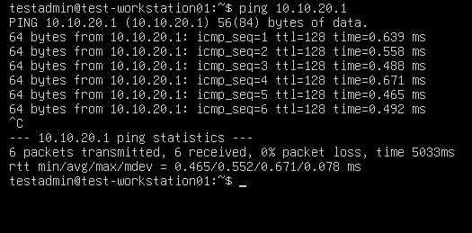
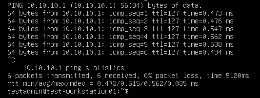
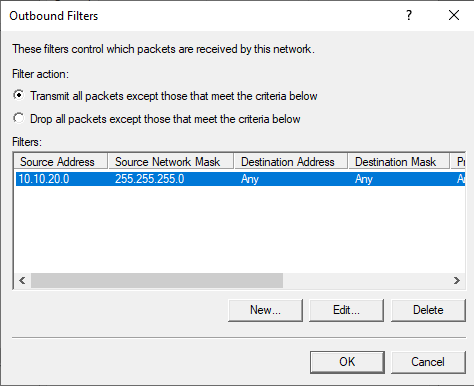
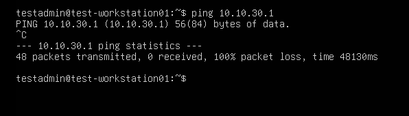

# Project 1 — Multi-Subnet Enterprise Network

## Overview
A segmented enterprise network built in VMware Workstation Pro, isolating traffic into four distinct zones — Servers, Workstations, Management, and Guest — with a central Windows Server routing between them and firewall policy controlling exactly what's allowed to cross between segments. This mirrors how real business networks are designed: rather than one flat network where every device can reach every other device, traffic between zones is deliberately routed through a single controllable checkpoint.

## Architecture Diagram

## Objectives
- Design a realistic private IP addressing scheme across 4 network segments
- Build isolated virtual switches for each segment
- Route between segments using a central Windows Server (RRAS)
- Enforce firewall policy limiting which segments can reach which others
- Document and prove the design works with real connectivity tests, not just configuration

## Tools & Technologies
- VMware Workstation Pro (host-only virtual networking)
- Windows Server 2022 Standard (Desktop Experience)
- RRAS (Routing and Remote Access Service)
- RRAS IP Packet Filters (inbound/outbound, per-interface)
- Ubuntu Server (throwaway test VM for validation)

## IP Addressing Scheme
| Segment | Subnet | Gateway (DC01) |
|---|---|---|
| Servers | 10.10.10.0/24 | 10.10.10.1 |
| Workstations | 10.10.20.0/24 | 10.10.20.1 |
| Management | 10.10.30.0/24 | 10.10.30.1 |
| Guest | 10.10.40.0/24 | 10.10.40.1 |

## Build Process
1. **Designed the IP scheme** before touching any software — four non-overlapping /24 subnets, one per network zone, using private (RFC 1918) address space.
2. **Created 4 isolated Host-only virtual networks** (VMnet2-5) in VMware's Virtual Network Editor, matching the subnet design. DHCP was intentionally left disabled on each, since IP addressing is centrally managed by the domain controller rather than the virtual switching layer.
3. **Built DC01** — Windows Server 2022 Standard (Desktop Experience), 4 network adapters, one attached to each VMnet. Chose Desktop Experience deliberately to use the graphical AD/GPO/DNS tools while learning these concepts for the first time; a Server Core rebuild is a reasonable follow-up exercise later.
4. **Matched each adapter to its correct VMnet** using MAC address cross-referencing (`Get-NetAdapter` in Windows vs. each adapter's Advanced settings in VMware), then renamed adapters to self-documenting names (e.g. "Servers-VMnet2") to avoid ever repeating that exercise.
5. **Assigned static IPs** to all 4 adapters matching the design (10.10.10.1, 10.10.20.1, 10.10.30.1, 10.10.40.1), each with subnet mask 255.255.255.0 and no default gateway (since DC01 itself is the gateway for each subnet).
6. **Installed and configured RRAS** via Server Manager's Remote Access role, enabled through Custom Configuration → LAN Routing.

7. **Built a throwaway test VM** (Ubuntu Server, single adapter, reassignable between VMnets) specifically to validate the design from an ordinary endpoint's perspective rather than testing from DC01 itself.
8. **Proved routing works** with two ping tests: a same-subnet ping (ttl=128, 0 hops) confirming basic connectivity, and a cross-subnet ping to a network the test VM had zero direct connection to (ttl=127, 1 hop) — proof DC01 was genuinely forwarding traffic between isolated VLANs, not just that the individual networks were up.

10. **Implemented firewall policy using RRAS IP Packet Filters** (not the standard Windows Defender Firewall GUI, which does not filter transit/routed traffic — only traffic to/from the local host):
   - **Guest → blocked from everything**, including DC01's own Guest-side interface (an inbound filter on the Guest interface, dropping all traffic sourced from 10.10.40.0/24 regardless of destination).
   - **Workstations → Servers: allowed** (required for Project 2's Active Directory to function).
   - **Workstations → Management: blocked** (an outbound filter on the Management interface, since this traffic arrives via the Workstations interface and only needs blocking as it exits toward Management — an inbound filter on Management alone does not catch traffic merely passing through).
     
   
   
   
   - **Management → everywhere: allowed by default** (no restrictions added, matching the IT admin network's need for broad access).
11. **Validated every rule** by reassigning the same test VM between VMnets and re-running targeted ping tests for each path (Guest→Servers blocked, Guest→own gateway blocked, Workstations→Servers allowed, Workstations→Management blocked).

## Problems Encountered & Fixes
- **VM wouldn't boot from ISO** — "Cannot connect virtual device sata0:1," then a missed "press any key" prompt. Fixed by explicitly setting the CD/DVD device to "Use ISO image file" with "Connect at power on" checked, and catching the boot prompt by pressing a key the instant the screen changed on retry.
- **Duplicate network adapters** — repeated "Add" clicks in VMware created 7 adapters instead of 4. Fixed by reviewing the full device list against the design and removing the 3 extras.
- **Generic adapter names gave no indication of which VMnet each was on** — resolved via MAC address cross-referencing between Windows and VMware, then renamed for clarity going forward.
- **First firewall rule (Workstations → Management) silently failed to block traffic** despite being configured and RRAS being restarted. Root cause: the rule was placed as an *inbound* filter on the Management interface, which only inspects traffic arriving *into* Management directly — it does not see traffic that arrives via a different interface (Workstations) and is merely being forwarded *out* through Management. Fixed by switching to an *outbound* filter on the Management interface instead, which correctly catches traffic as it exits toward Management regardless of which interface it originally entered through.

## Key Takeaways / Skills Demonstrated
- Private IP addressing design (RFC 1918) and subnetting across multiple segments
- Configuring RRAS as a multi-homed router between isolated VLANs
- Understanding the distinction between routing (making communication *possible*) and firewall policy (deciding what's actually *allowed*) — and why both were tested in that order
- Diagnosing and correctly resolving inbound vs. outbound packet filter direction — a genuinely subtle networking concept, not just a configuration checkbox
- Validating a network design with real, repeatable connectivity tests rather than relying on configuration alone as proof
- Professional documentation practices: Jira for task tracking, a running technical notes archive, and GitHub as the presentable deliverable

## Current Scope Note
Layer 2/3 VLAN tagging (802.1Q) was intentionally not used here — VMware Workstation's virtual networking doesn't support true VLAN trunking, so this design uses 4 separate virtual switches rather than one trunked switch. Genuine 802.1Q VLAN tagging will be implemented properly in Project 5 using pfSense's native VLAN support.
