# Project 2 — Active Directory

## Overview
Building a real Active Directory domain on top of the Project 1 network — 
centralized identity management, Group Policy, and proper permission delegation.

## Progress Log

### Domain Controller Promotion
- Installed the AD DS server role on DC01, then promoted it via the AD DS 
  Configuration Wizard
- Created a new forest and domain: `corp.local`
- DC01 renamed from default hostname prior to promotion to keep it consistent 
  with lab naming conventions and avoid post-promotion rename complexity
- Verified with `dcdiag` — all tests passed
- DC01 now serves as domain controller, DNS server, and RRAS router 
  simultaneously — a valid small-business consolidation pattern, though 
  enterprise environments typically separate these roles across dedicated 
  servers

**Screenshots:**

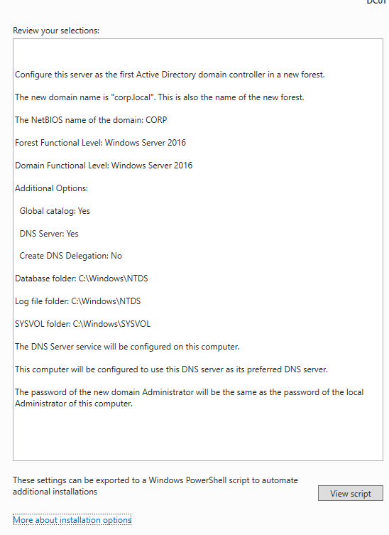

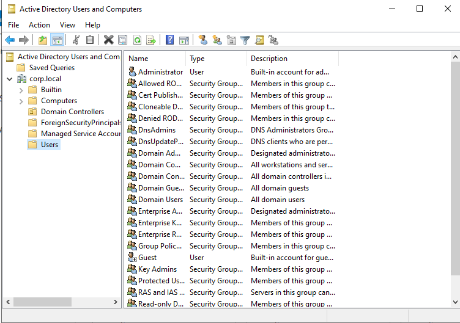

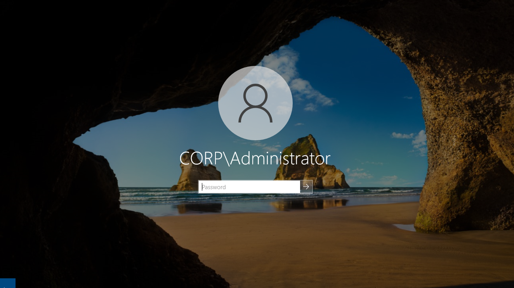

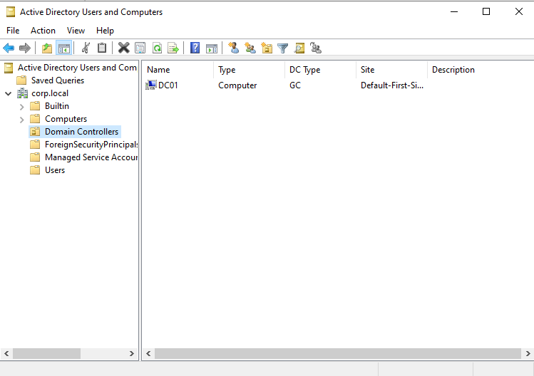

**Verification:**

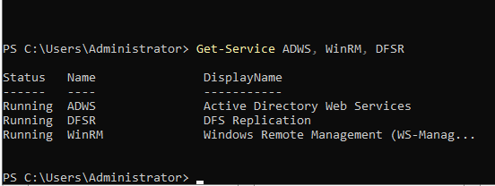

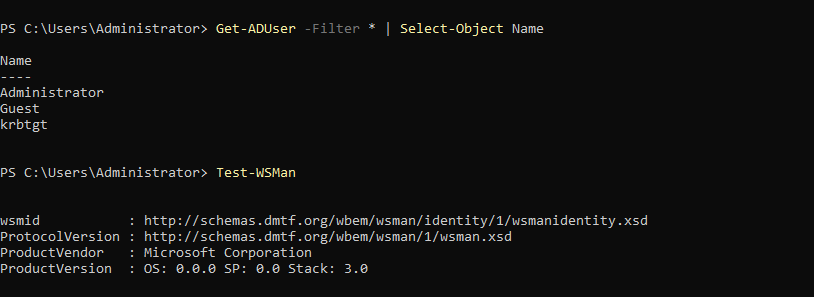

  ### Problems Encountered & Fixes
**dcdiag flagged SystemLog test failures (ADWS/WinRM) after DC promotion**
- After promoting DC01, `dcdiag` repeatedly failed its SystemLog test, citing 
  WinRM SPN registration issues and an ADWS startup timeout (45s)
- Confirmed via `Get-Service` that all relevant services were actually Running, 
  despite the log language suggesting otherwise
- Rather than trust the diagnostic tool blindly, tested the actual functionality 
  directly: `Get-ADUser` (uses ADWS) returned valid results, `Test-WSMan` 
  confirmed WinRM was listening correctly
- Root cause: dcdiag's SystemLog test scans for stale error-log entries from a 
  resource-constrained boot (AD/DNS/RRAS/ADWS/WinRM all competing for startup 
  resources), not live service health — a one-time slow start, not an ongoing 
  failure
- No fix was required; verified functionally correct behavior over trusting a 
  diagnostic warning at face value

  ### Client VM Domain Join

- Built WS01 (Windows 11 Pro) on VMnet3 (Workstations, 10.10.20.0/24)
- Configured static IP, gateway, and DNS (pointed at DC01)
- Verified pre-join connectivity: ping to DC01 (0% loss) and `nslookup corp.local`
  (confirmed DNS resolution before attempting domain join)
- Renamed computer to WS01 and joined `corp.local` in a single step via
  System Properties
- Created a reverse lookup zone (`20.10.10.in-addr.arpa`) and ran
  `ipconfig /registerdns` on DC01 to populate a missing PTR record — resolved
  `nslookup` showing "Server: UnKnown" instead of "Server: DC01.corp.local"
- Verified domain membership from both sides: `whoami` on WS01 confirmed
  `corp\administrator` login; ADUC on DC01 shows WS01 registered under the
  default Computers container

**Screenshots:**

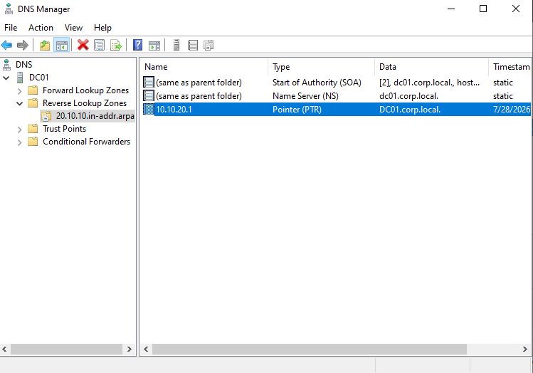

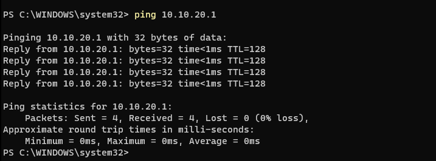

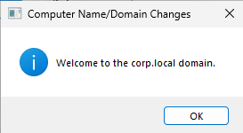

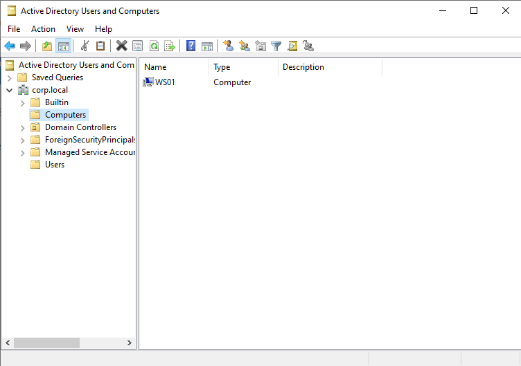

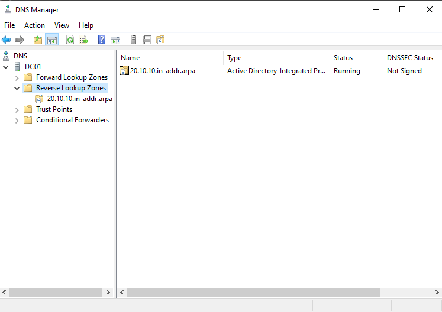

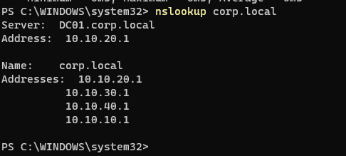

### Problems Encountered & Fixes

**Reverse DNS not resolving (nslookup showed "Server: UnKnown")**
- Created a reverse lookup zone, but no PTR record existed yet since the zone
  didn't exist when DC01 first came online
- Ran `ipconfig /registerdns` on DC01 to force re-registration; PTR record
  appeared and `nslookup` began correctly showing `Server: DC01.corp.local`

**Domain login failed with "Invalid credentials" despite correct password**
- Root cause: typed `CORP/Administrator` (forward slash) instead of the
  required `CORP\Administrator` (backslash) domain-login format
- Corrected the format; login succeeded, confirmed via `whoami`

### OUs, Security Groups, and Service Accounts

- Designed a departmental OU structure: `Departments` (containing IT, Sales,
  Marketing, Finance), a separate `Management` OU, and an isolated
  `Service Accounts` OU — kept separate from regular users per AD best
  practice, since service accounts warrant different policies (e.g. no
  interactive logon, different password rules) than human accounts
- Created matching security groups per department, plus a dedicated
  `Helpdesk-Group` (inside IT) to set up upcoming delegation of limited
  admin rights
- Created 2 service accounts (`svc-backup`, `svc-wazuh`) with
  "Password never expires" intentionally enabled — a deliberate setting for
  non-interactive accounts, not a security shortcut, since a service account
  has no person available to respond to a password-expiry prompt

**Screenshots:**

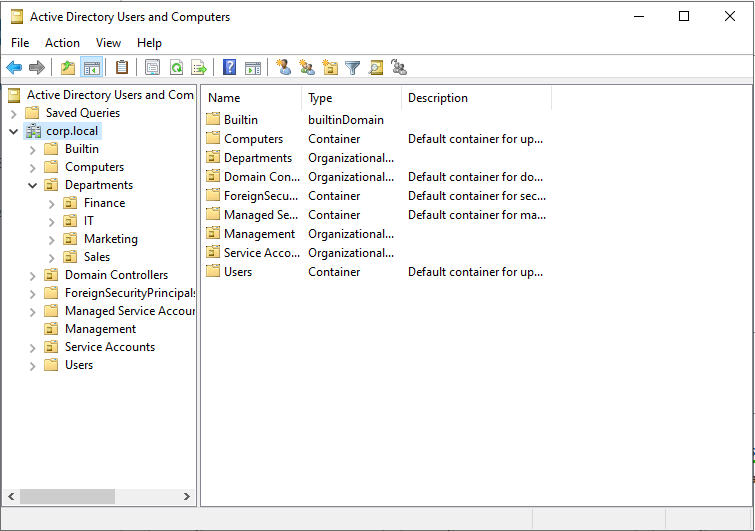

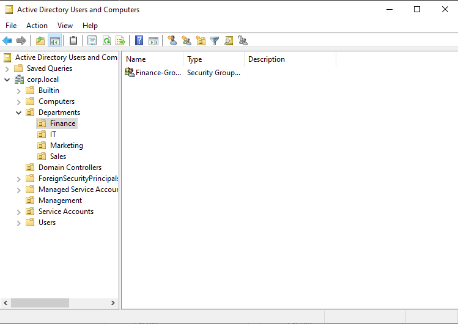

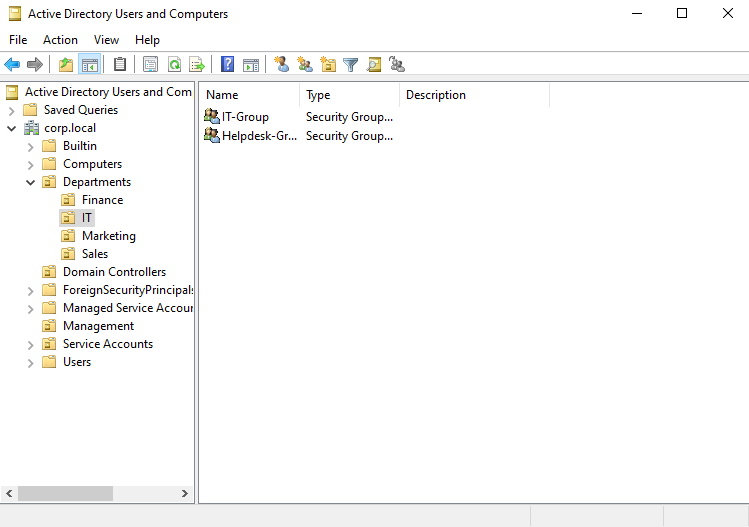

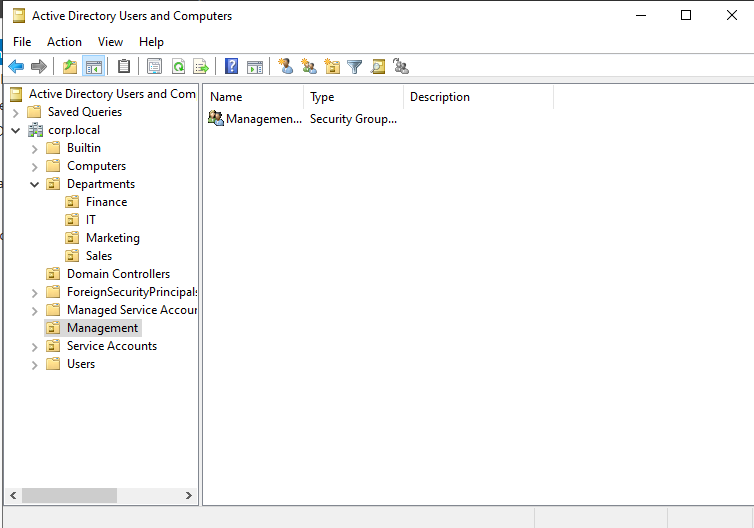

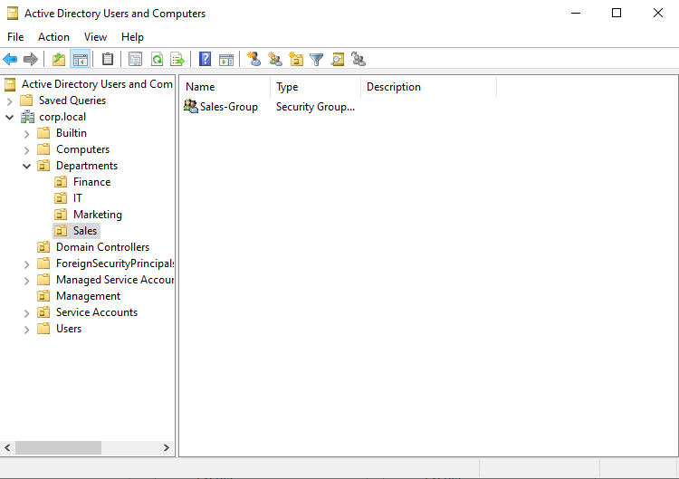

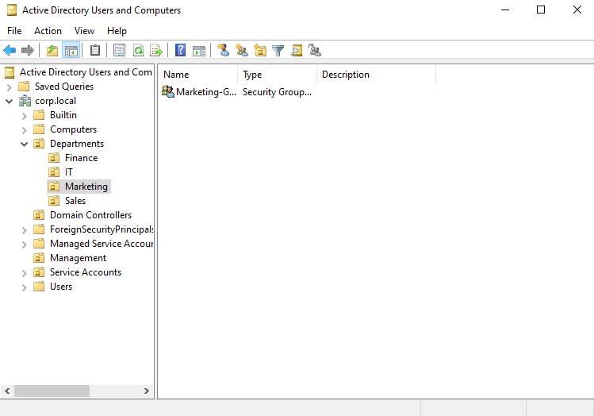

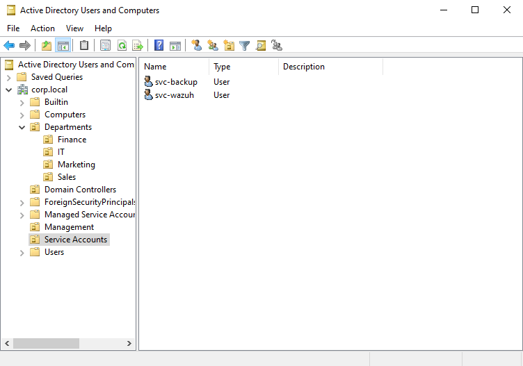

### Problems Encountered & Fixes

**Accidentally created an OU nested in the wrong location, couldn't delete it**
- Attempted to delete a misplaced `Service Accounts` OU (nested under
  Departments instead of the domain root) — got an "Access is denied" error
  despite being logged in as domain Administrator
- Root cause: AD's built-in "Protect object from accidental deletion" setting,
  checked by default on every OU — not an actual permissions issue
- Fix: enabled View → Advanced Features in ADUC, unchecked the protection
  flag on the Object tab, deleted and recreated the OU correctly

  ### Group Policy Objects (GPOs)

- **Domain Password Policy** — linked to the domain root (`corp.local`), since
  default domain password policy can only be set at the domain level, not an
  individual OU. Configured: 10-character minimum, complexity required,
  90-day max age, 5-password history
- **Disable USB Storage** — Computer Configuration Policy, linked to the IT OU.
  A security control (not a Preference), since it must be enforced and
  non-reversible by a local user
- **Map IT Shared Drive** — User Configuration Preference, linked to the IT
  OU. Maps `\\DC01\IT-Shared` to `Z:`. Built as a Preference rather than a
  Policy since it's a convenience setting, not a security boundary — users
  can remap/remove it without Group Policy fighting the change
- Created a shared folder on DC01 (`C:\Shares\IT-Shared`) to support the
  drive-mapping GPO, scoped to Everyone: Read/Write for lab simplicity (in
  production this would be scoped to a specific security group instead)
- Moved WS01 from the default Computers container into the IT OU, then ran
  `gpupdate /force` to apply the new OU's linked policies
- Verified all three GPOs via `gpresult /r`: Password Policy and USB
  restriction confirmed under Computer Settings; Map IT Shared Drive
  confirmed under User Settings (after testing with a proper IT-OU test user
  rather than the built-in Administrator account — see Problems Encountered)
- Verified the mapped drive visually: `Z: (IT-Shared)` appeared in File
  Explorer

**Screenshots:**

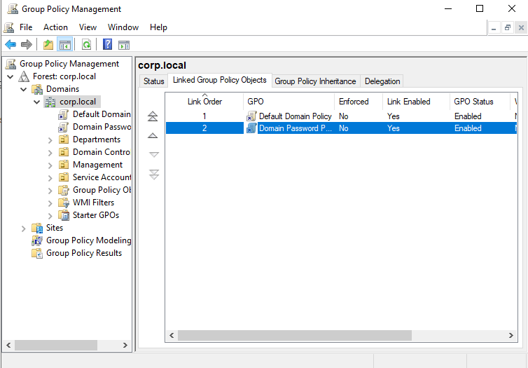

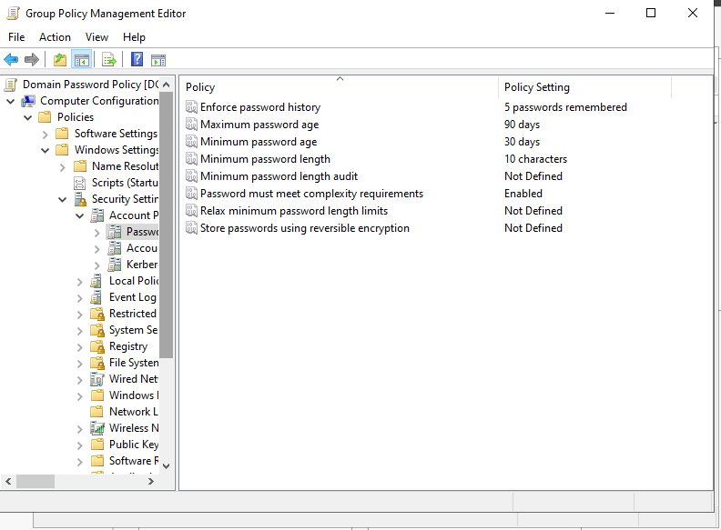

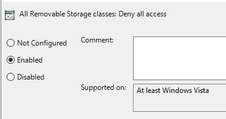

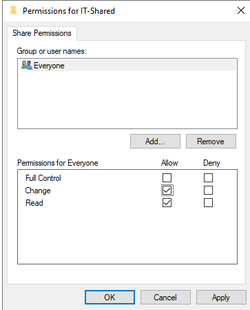

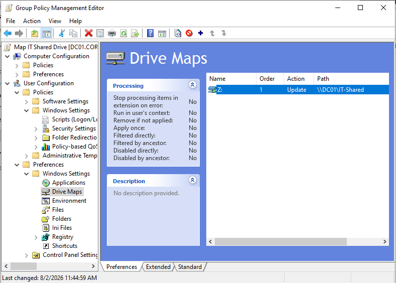

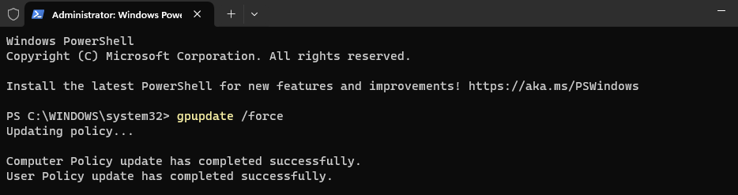

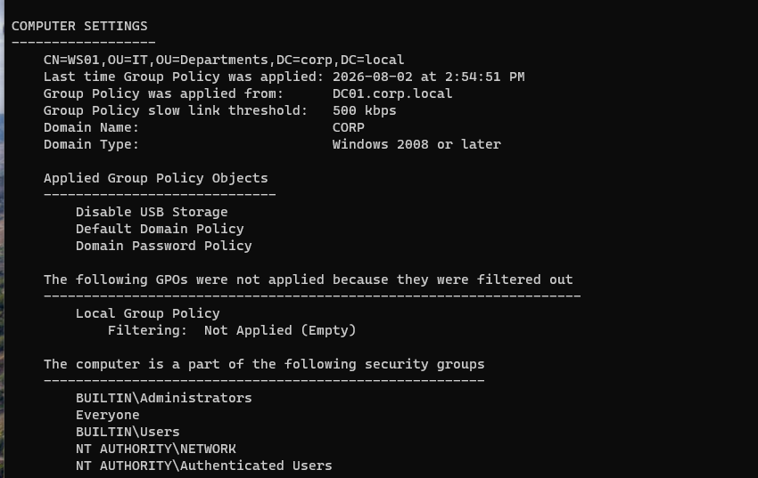

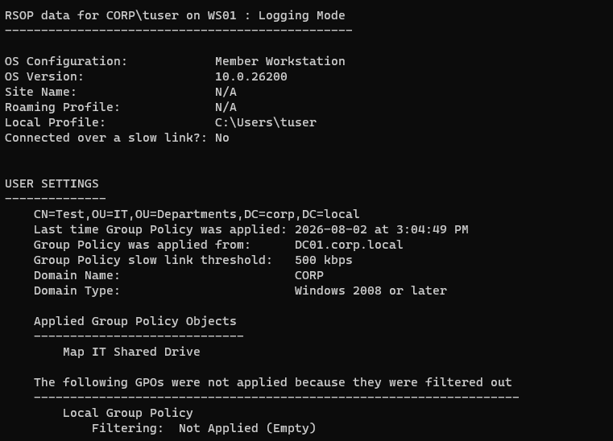

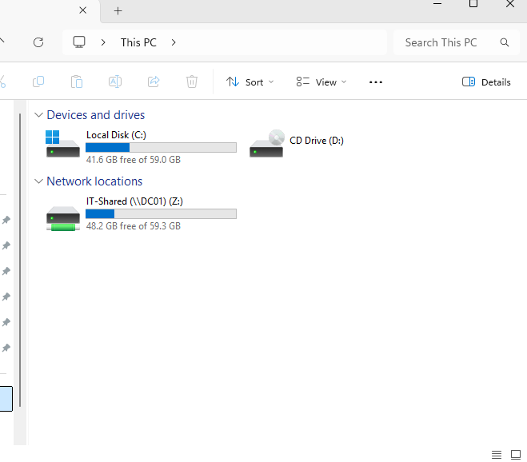

### Problems Encountered & Fixes

**Map IT Shared Drive GPO didn't apply when tested as Administrator**
- `gpresult` showed "N/A" for User Settings when logged in as
  `CORP\Administrator`, despite WS01 (the computer) being correctly moved
  into the IT OU
- Root cause: User Configuration GPOs apply based on the logged-in *user's*
  OU placement, independent of the computer's OU — Administrator lives in
  the default Users container, not IT
- Fix: created a real test user (`tuser`) inside the IT OU; `gpresult`
  confirmed the GPO applied correctly for that account, and the Z: drive
  appeared as expected